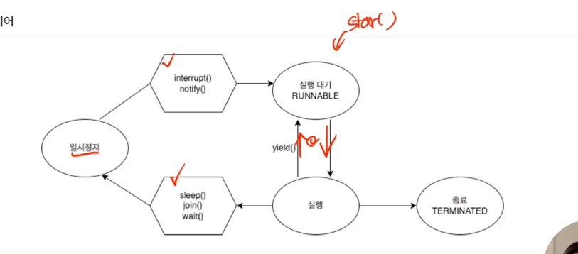

# 멀티 쓰레드
자바에서 멀티쓰레드를 구현하기 앞서 쓰레드에 대해 알아보도록 하자.

## 쓰레드
> 예시) 운영체제에서 크롬브라우저와 카카오톡을 실행시킨다.
> 
> == 운영체제는 카카오톡 프로세스와 크롬 브라우저 프로세스를 실행한다.
> 
> 각 프로세스가 작업중인 프로그램에서 실행 요청이 들어온다 => 쓰레드를 생성한다.

### 프로세스
프로세스는 운영체제로부터 자원을 할당받는 작업의 단위이다.

이때, 프로세스 안에 코드, 데이터, 메모리영역 을 같이 할당해준다.

코드는 자바 메인 메소드 같은 코드

데이터는 프로그램이 실행중에 전역변수, 정적변수, 배열등을 저장하는 공간

메모리 영역은 스택과 힙으로 나눠진다.

스택에는 지역변수, 매개변수, 리턴변수가 저장된다.

힙에는 동적으로 필요한 공간을 할당한다.

### 쓰레드린 프로세스가 할당받은 자원을 이용하는 실행의 단위

프로세스 내에 일하는 일꾼으로 이해하면 된다. 

명령이 들어오면 생성되기 때문에, 자원관리가 필요하다. 

쓰레드는 자신만의 스택 메모리 공간도 할당받는다.

## 싱글쓰레드
그 동안 자바에서 작성한 코드는 싱글쓰레드이다. 

> 자바 프로그램을 실행한다. == JVM 프로세스를 실행한다.
> 
> JVM에 의해, 자바 Main 쓰레드가 실행된다.

```java
public class main{
public static void main(String[] args){

    }
}
```
위 코드가 메인쓰레드


## 멀티쓰레드 구현하기
여러개의 쓰레드를 실행 == 멀티쓰레드
 ### how? 
main()안에서 여러개의 쓰레드를 실행시키도록
### why?
스택을 제외한 모든 영역에서 메모리를 공유하기때문에, 자원을 효울적으로 사용

응답쓰레드와 작업쓰레드를 분리하여 빠르게 응답을 제공

> 하지만, 동기화 문제가 발생하고, 데드락이 발생할 수 있다.

### step1 
```java
public class testThread extends Thread{ //1. Thread를 상속받는다.
    //2. run 메소드 생성
    @Override
    public void run() {
//        super.run();
        //3. 실제 우리가 쓰레드에서 수행할 작업을 적는다.
        System.out.println("test");
        for(int i=0; i<100; i++){
            System.out.println("*");
        }
    }
}
```
```java
public class Main {
    public static void main(String[] args) {
        testThread thread = new testThread();
        thread.start();
    }//4. 메인 메소드에서 구현
}
```
Thread를 상속받은 testThread 안에 메소드를 구현하고, 

메인 메소드에서 thread 인스턴스를 생성하여 동작을 시켰다. 

### step2
```java
public class TestRunnable implements Runnable {
    @Override
    public void run() {
        //Thread에서 수행할 작업을 정의
        for(int i=0; i<100; i++){
            System.out.println("#");
        }
    }
}

public class Main {
    public static void main(String[] args) {
        Runnable run = new TestRunnable();
        Thread thread = new Thread(run);
        thread.start();
    }//4. 메인 메소드에서 구현
}
```
runnable을 이식받은 testRunnable에서 수행할 메소드를 구현하고,

메인에서 testRunnable 인스턴스 생성,

thread 인스턴스도 생성하며, 생성자 변수에 아까의 인스턴스를 넣는다. 

### step3 람다식 활용
```java
public class Main {
    public static void main(String[] args) {

        Runnable task = () -> {
            int sum=0;
            for(int i=0; i<100; i++){
                sum+=i;
                System.out.println(sum);
            }
            System.out.println(Thread.currentThread().getName() + " 최종 합 : " + sum);
        };

        Thread thread1 = new Thread(task);
        thread1.setName("thread1");
        Thread thread2 = new Thread(task);
        thread2.setName("Thread2");

        thread1.start();
        thread2.start();
    }
}
```
> 출력값을 보았을 때, 쓰레드 2개가 동시에 수행되는 것을 볼 수 있다. 
> 
> 이를 멀티쓰레드라고 한다.


### step 4 싱글 쓰레드와 멀티 쓰레드
싱글쓰레드
```java
package single;

public class Main {
    public static void main(String[] args) {
        Runnable task = () -> {
            System.out.println("2번 : "+Thread.currentThread().getName());
            //출력값 = "2번 : 쓰레드1";
            for (int i = 0; i < 100; i++) {
                System.out.print("$");
            }
        };


        System.out.println("1번 : "+Thread.currentThread().getName());
        //출력값 = "1번 : main";

        Thread thread1 = new Thread(task);
        thread1.setName("쓰레드1");

        thread1.start();
    }
}
// 이를 통해 쓰레드1 을 실행하기 전에는 메인쓰레드가 동작하다가 쓰레드1 이 실행된다는 것을 알 수 있다.
```
멀티쓰레드
```java
package muti;

public class Main {
    public static void main(String[] args) {
        // 쓰레드1
        Runnable task = () -> {
            for (int i = 0; i < 100; i++) {
                System.out.print("$");
            }
        };

        // 쓰레드2
        Runnable task2 = () -> {
            for (int i = 0; i < 100; i++) {
                System.out.print("*");
            }
        };


        Thread thread1 = new Thread(task);
        thread1.setName("thread1");
        Thread thread2 = new Thread(task2);
        thread2.setName("thread2");

        thread1.start();
        thread2.start();
        // 멀티 쓰레드 출력값
        // ************************$$$$$$$$$$$$$$$$$$$$$$$$$$$$$$$$*$*******************************************$$*$*$$$$$$$*************$$$$$$$$$$$$*****************$$$$$$$$$$$$$$$$$$$$$$$$$$$$$$$$$$$$$$$$$$$$$
    }
}
```

## 데몬쓰레드, 사용자 쓰레드, 우선순위, 쓰레드 그룹

### 데몬 쓰레드
우선순위가 낮은 보이지 않는 곳에서 실행되는 쓰레드

보조적인 역할을 담당

메모리 영역을 정리해주는 가비지 콜렉터가 이에 해₩

```java
package single;

public class Main {
    public static void main(String[] args) {
        Runnable task = () -> {
            System.out.println("2번 : "+Thread.currentThread().getName());
            //출력값 = "2번 : 쓰레드1";
            for (int i = 0; i < 10000; i++) {
                System.out.println(i+" 번째 데몬");
            }
        };


        System.out.println("1번 : "+Thread.currentThread().getName());
        //출력값 = "1번 : main";

        Thread thread1 = new Thread(task);
        thread1.setName("쓰레드1");
        thread1.setDaemon(true);
        //우선순위가 낮은 데몬으로 설정할 것이냐

        thread1.start();

        for (int i = 0; i < 100; i++) {
            System.out.println(i+ "번째 메인 쓰레드");
        }
    }
}
//출력값을 보면, 데몬이 반복문을 다 순회하기 전 메인메소드가 끝날 시 같이 끝나는 것이 보인다. 
```

### 사용자 쓰레드
보이는 곳에서 실행되는 우선순위가 높은 쓰레드

메인쓰레드가 이에 해당

jvm은 사용자쓰레드의 작업이 끝나면, 데몬 쓰레드도 자동으로 종료해버린다. 

### 우선순위
최대 우선순위 = 10 ,
최소 1 ,
보통 5 , 우선순위를 지정하지 않는다면 우선순위는 보통 5로 입력된다. 
```java
package muti;

public class Main {
    public static void main(String[] args) {
        // 쓰레드1
        Runnable task = () -> {
            for (int i = 0; i < 100; i++) {
                System.out.print("$");
            }
        };

        // 쓰레드2
        Runnable task2 = () -> {
            for (int i = 0; i < 100; i++) {
                System.out.print("*");
            }
        };


        Thread thread1 = new Thread(task);
        thread1.setName("thread1");
        thread1.setPriority(10);
        Thread thread2 = new Thread(task2);
        thread2.setName("thread2");
        thread2.setPriority(1);

        thread1.start();
        thread2.start();
        
        //출력값으로는 관찰이 힘들고, 무거운 프로그램시 효과적이다.
    }
}
```
### 쓰레드 그룹
```java
package muti;
public class Main {
    public static void main(String[] args) {
        Runnable task = () -> {
            while (!Thread.currentThread().isInterrupted()) {
                try {
                    Thread.sleep(1000);
                    System.out.println(Thread.currentThread().getName());
                } catch (InterruptedException e) {
                    break;
                }
            }
            System.out.println(Thread.currentThread().getName() + " Interrupted");
        };

        //1.  ThreadGroup 클래스로 객체를 만듭니다.
        ThreadGroup group1 = new ThreadGroup("Group1");

        //2.  Thread 객체 생성시 첫번째 매개변수로 넣어줍니다.
        // Thread(ThreadGroup group, Runnable target, String name)
        Thread thread1 = new Thread(group1, task, "Thread 1");
        Thread thread2 = new Thread(group1, task, "Thread 2");

        //3.  Thread 에 ThreadGroup 이 할당된것을 확인할 수 있습니다.
        System.out.println("Group of thread1 : " + thread1.getThreadGroup().getName());
        System.out.println("Group of thread2 : " + thread2.getThreadGroup().getName());

        //4.  Thread 에게 할당된 업무를 시작시킨다. (멀티쓰레드)
        thread1.start();
        thread2.start();

        try {
            // 현재 쓰레드를 지정된 시간동안 멈추게 합니다.
            Thread.sleep(5000);
        } catch (InterruptedException e) {
            e.printStackTrace();
        }

        // interrupt()는 일시정지 상태인 쓰레드를 실행대기 상태로 만듭니다.
        group1.interrupt();

    }
}
```
group 으로 묶어 한번에 interrupt 를 시키는 것이 목적

group으로 생성하는 방법과 통제하는 방법이 중요

## 쓰레드 상태
쓰레드는
1. 객체가 생성이 되고, start 와 함께
2. 실행되기상태(runnable)
3. 실행상태
4. 2.3.을 계속해서 반복함
5. 종료한다.

 

### Sleep()
현재의 쓰레드를 지정된 시간동안 멈추게 한다.

sleep()은 쓰레드 자기자신에 대해서만 멈추게 할 수 있다.

즉, static 메소드이기 때문에 흐름 안에 쓰레드를 잠자게 한다. 

쓰레드는 try catch 로 작성해야 한다.

### interrupt()
sleep과 같이 사용되어 interrupt가 발생시

interruptedException이 발생하여 쓰레드를 제어할 수 있다.

### join()
정해진 시간동안 지정한 쓰레드가 작업하는 것을 기다린다.

main thread 안에 thread1을 넣으면 (멀티쓰레드) main이 thread1을 기다려주지 않는다. 


